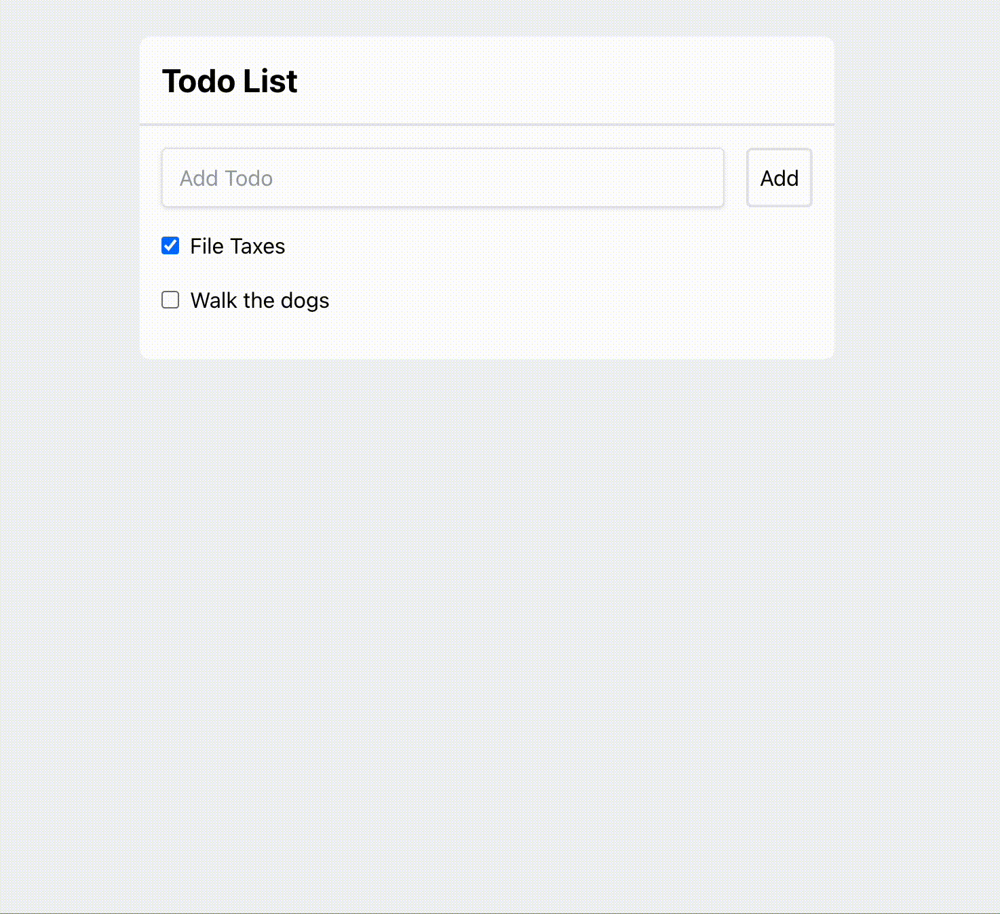

# todo-templ-htmx-tailwind

This is an ultra-simple example app I used to experiment with Go, HTMX, Templ, and Tailwind.

[Templ](https://templ.guide) provides a much better htmp component system than the `html/template` standard library which struggles with even the most primitive composition. Templ on the otherhand does a great job at providing composition as well as accessing functions within go without having to pass them into the template.

[HTMX](https://htmx.org) extends html functionality to replace chunks of html using traditional rest implementations. This removes the need for writing client side javascript in most situations while creating modern web applications.

TailwindCSS and Go are pretty self explanatory.

Some parts of this code was generated by ChatGPT and I think some of the http server structure was borrowed from a common template that's floating around but I can't find the original source.

